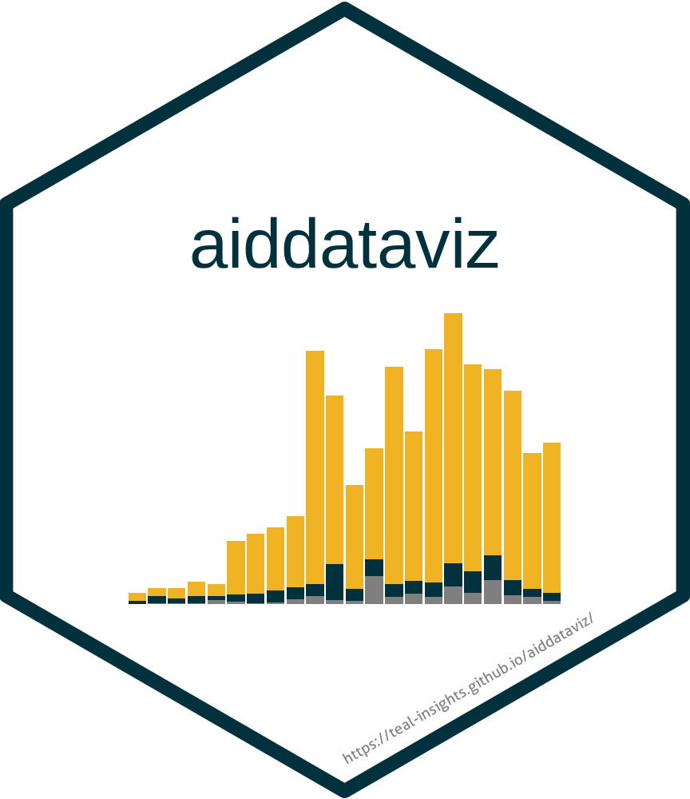

<!-- README.md is generated from README.Rmd. Please edit that file -->

```{r, include = FALSE}
knitr::opts_chunk$set(
  collapse = TRUE,
  comment = "#>",
  fig.path = "man/figures/README-",
  out.width = "100%",
  dev = "ragg_png",
  dpi = 300
)
```

# aiddataviz <a href="https://teal-insights.github.io/aiddataviz/"></a>

<!-- badges: start -->

[](https://github.com/Teal-Insights/aiddataviz/actions/workflows/R-CMD-check.yaml) [](https://app.codecov.io/gh/Teal-Insights/aiddataviz)

<!-- badges: end -->

## Overview

aiddataviz is a ggplot2 extension package that implements William & Mary's brand guidelines for AidData visualizations. It provides themes, color palettes, and helper functions to create beautiful, accessible, and on-brand data visualizations.

This package was created by [Teal Emery](https://www.tealemery.com/) as part of an [applied data analysis course](https://teal-insights.github.io/data_analysis_for_chinese_debt_data/) for AidData staff. While it is intended for use by AidData, it is not an official AidData product.

***NOTE: aiddataviz is brand new and still under heavy development. With your feedback, we can make this an awesome tool. Please understand it is a work in progress, and will likely have breaking changes (the code that works today, may not work tomorrow) in the coming weeks as it is finalized.***

## Installation

You can install the development version of aiddataviz from [GitHub](https://github.com/) with:

``` r
# install.packages("pak")
pak::pak("Teal-Insights/aiddataviz")
```

### Fonts

When you load the `aiddataviz` package with `library(aiddataviz)`, you will be prompted to install the required fonts (`Roboto` and `Open Sans`) automatically. Simply type `y` and press enter to install them.

If you'd prefer to install the fonts manually, you can get them from [Google Fonts](https://fonts.google.com/): - [Roboto](https://fonts.google.com/specimen/Roboto) - [Open Sans](https://fonts.google.com/specimen/Open+Sans)

On Windows, custom system fonts may be unavailable to the default RMarkdown rendering engine. If you're having trouble, try setting `dev = "ragg_png"` in your RMarkdown chunk options. For example, add `knitr::opts_chunk$set(dev = "ragg_png")` to the top of your RMarkdown file.

## Example

Here's a basic example showing how to use aiddataviz themes and color scales to create visualizations in the style of AidData's research publications:

```{r example, message=FALSE}
library(aiddataviz)
library(ggplot2)
library(dplyr)

# Create a stacked bar chart of Chinese development finance flows
ggplot(gcdf_yearly_flows, 
       aes(x = commitment_year, 
           y = commitments_bn,
           fill = flow_class)) +
  geom_col() +
  labs(
    title = "Chinese Official Finance Flows to Developing Countries",
    subtitle = "Annual commitments by flow class, 2000-2021",
    x = "Year",
    y = "USD Billions (2021)",
    fill = "Flow Class",
    caption = "Source: AidData's Global Chinese Development Finance Dataset, Version 3.0"
  ) +
  scale_fill_aiddata(palette = "default") +
  theme_aiddata()
```

# Color Palettes

The package provides several color palettes based on William & Mary's brand guidelines, designed for different visualization needs:

***Note: These palettes were developed based on William & Mary's brand guidelines and analysis of AidData's publications. They can and should be adjusted based on feedback from the AidData communications team.***

## Categorical Palettes

### Default (Three Colors)

The default palette uses AidData's three primary colors: Wren Twilight blue, Spirit Gold, and Silver. This palette is ideal for categorical data with three groups and matches the style commonly used in AidData's publications.

```{r default-palette}
library(monochromeR)
aiddata_palettes$default |> view_palette()
```

### One Color

For single-variable visualizations, we use Wren Twilight blue, William & Mary's signature color.

```{r one-color}
aiddata_palettes$one_color |> view_palette()
```

### Two Colors

Combines Wren Twilight blue and Spirit Gold for binary categorical data.

```{r two-colors}
aiddata_palettes$two_colors |> view_palette()
```

### Three Colors

Same as the default palette, provided for explicit naming consistency.

```{r three-colors}
aiddata_palettes$three_colors |> view_palette()
```

### Four Colors

Adds Patina to the three-color palette for visualizations requiring additional categories.

```{r four-colors}
aiddata_palettes$four_colors |> view_palette()
```

### Five Colors

Incorporates Vine as the fifth color, completing the primary color set.

```{r five-colors}
aiddata_palettes$five_colors |> view_palette()
```

## Sequential Palettes

### Sequential Green

A gradient from Griffin Green through College Woods and Patina to light gray. Ideal for ordered data where darker values indicate higher intensity.

```{r sequential-green}
aiddata_palettes$sequential_green |> view_palette()
```

### Sequential Gold

A gradient from Spirit Gold through Colonial Yellow to light gray. Provides an alternative to the green sequence that maintains AidData's visual identity.

```{r sequential-gold}
aiddata_palettes$sequential_gold |> view_palette()
```

## Diverging Palettes

### Diverging Green-Gold

A diverging palette centered on silver, moving from Griffin Green through Patina on one end to Colonial Yellow and Spirit Gold on the other. Ideal for data with meaningful center points or positive/negative values.

```{r diverging-green-gold}
aiddata_palettes$diverging_green_gold |> view_palette()
```

### Diverging Vine-Sky

An alternative diverging palette using Vine through Weathered Brick to College Sky. Useful when you want to avoid green/gold associations or need a different visual emphasis.

```{r diverging-vine-sky}
aiddata_palettes$diverging_vine_sky |> view_palette()
```

## Learn More

-   [Package website](https://teal-insights.github.io/aiddataviz/)
-   [William & Mary Brand Guidelines](https://www.wm.edu/about/brandguidelines/)
-   [AidData](https://www.aiddata.org/)

## Code of Conduct

Please note that the aiddataviz project is released with a [Contributor Code of Conduct](https://contributor-covenant.org/version/2/1/CODE_OF_CONDUCT.html). By contributing to this project, you agree to abide by its terms.
