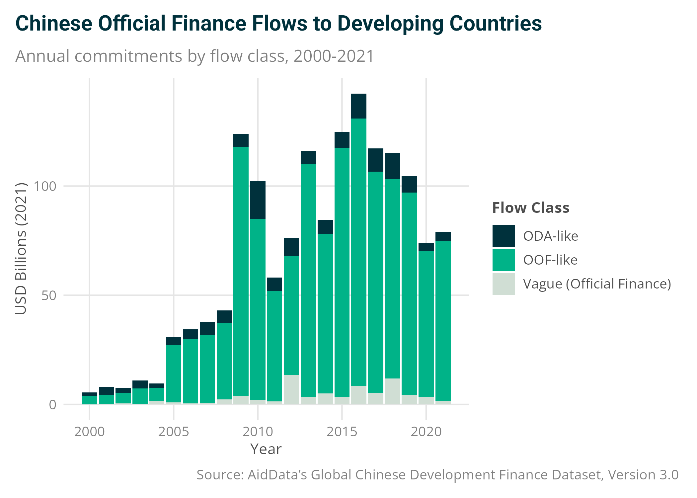
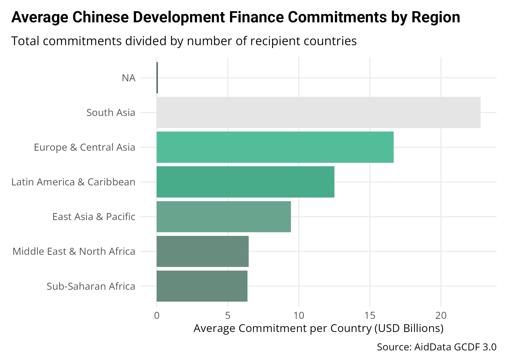
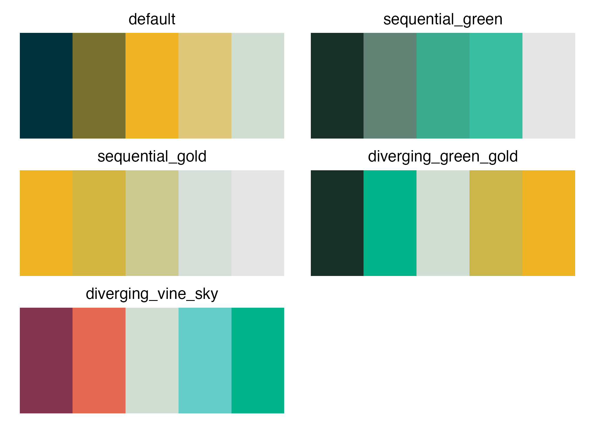

<!-- README.md is generated from README.Rmd. Please edit that file -->

# aiddataviz <a href="https://teal-insights.github.io/aiddataviz/"></a>

<!-- badges: start -->

[](https://github.com/Teal-Insights/aiddataviz/actions/workflows/R-CMD-check.yaml)
[](https://app.codecov.io/gh/Teal-Insights/aiddataviz)
<!-- badges: end -->

## Overview

aiddataviz is a ggplot2 extension package that implements William &
Mary’s brand guidelines for AidData visualizations. It provides
carefully crafted themes, color palettes, and helper functions to create
beautiful, accessible, and on-brand data visualizations.

## Installation

You can install the development version of aiddataviz from
[GitHub](https://github.com/) with:

``` r
# install.packages("pak")
pak::pak("Teal-Insights/aiddataviz")
```

### Fonts

When you load the `aiddataviz` package with `library(aiddataviz)`, you
will be prompted to install the required fonts (`Roboto` and
`Open Sans`) automatically. Simply type `y` and press enter to install
them.

If you’d prefer to install the fonts manually, you can get them from
[Google Fonts](https://fonts.google.com/): -
[Roboto](https://fonts.google.com/specimen/Roboto) - [Open
Sans](https://fonts.google.com/specimen/Open+Sans)

On Windows, custom system fonts may be unavailable to the default
RMarkdown rendering engine. If you’re having trouble, try setting
`dev = "ragg_png"` in your RMarkdown chunk options. For example, add
`knitr::opts_chunk$set(dev = "ragg_png")` to the top of your RMarkdown
file.

## Example

Here’s a basic example showing how to use aiddataviz themes and color
scales to create visualizations in the style of AidData’s research
publications:

``` r
library(aiddataviz)
library(ggplot2)
library(dplyr)
#> 
#> Attaching package: 'dplyr'
#> The following objects are masked from 'package:stats':
#> 
#>     filter, lag
#> The following objects are masked from 'package:base':
#> 
#>     intersect, setdiff, setequal, union

# Create a stacked bar chart of Chinese development finance flows
ggplot(gcdf_yearly_flows, 
       aes(x = commitment_year, 
           y = commitments_bn,
           fill = flow_class)) +
  geom_col() +
  labs(
    title = "Chinese Official Finance Flows to Developing Countries",
    subtitle = "Annual commitments by flow class, 2000-2021",
    x = "Year",
    y = "USD Billions (2021)",
    fill = "Flow Class",
    caption = "Source: AidData's Global Chinese Development Finance Dataset, Version 3.0"
  ) +
  scale_fill_aiddata(palette = "default") +
  theme_aiddata()
```



You can also create more complex visualizations. Here’s an example using
multiple AidData color palettes:

``` r
# Calculate and plot average commitment size by region
gcdf_country_commitments |>
  group_by(region_name) |>
  summarize(
    total_commitments = sum(total_commitments_bn),
    n_countries = n(),
    avg_commitment = total_commitments / n_countries
  ) |>
  ggplot(aes(x = reorder(region_name, avg_commitment), 
             y = avg_commitment,
             fill = avg_commitment)) +
  geom_col() +
  coord_flip() +
  labs(
    title = "Average Chinese Development Finance Commitments by Region",
    subtitle = "Total commitments divided by number of recipient countries",
    x = NULL,
    y = "Average Commitment per Country (USD Billions)",
    caption = "Source: AidData GCDF 3.0"
  ) +
  scale_fill_aiddata(
    palette = "sequential_green", 
    discrete = FALSE,
    guide = "none"
  ) +
  theme_aiddata()
```



The package includes several color palettes optimized for different
visualization needs:

``` r
library(patchwork)

# Helper function to show palettes
show_pal <- function(pal_name) {
  ggplot() +
    geom_tile(
      aes(x = 1:5, y = 1, fill = factor(1:5))
    ) +
    scale_fill_aiddata(palette = pal_name) +
    labs(title = pal_name) +
    theme_void() +
    theme(
      legend.position = "none",
      plot.title = element_text(hjust = 0.5)
    )
}

# Show all palettes
wrap_plots(
  show_pal("default"),
  show_pal("sequential_green"),
  show_pal("sequential_gold"),
  show_pal("diverging_green_gold"),
  show_pal("diverging_vine_sky"),
  ncol = 2
)
```



## Learn More

- [Package website](https://teal-insights.github.io/aiddataviz/)
- [William & Mary Brand
  Guidelines](https://www.wm.edu/about/brandguidelines/)
- [AidData](https://www.aiddata.org/)

## Code of Conduct

Please note that the aiddataviz project is released with a [Contributor
Code of
Conduct](https://contributor-covenant.org/version/2/1/CODE_OF_CONDUCT.html).
By contributing to this project, you agree to abide by its terms.
